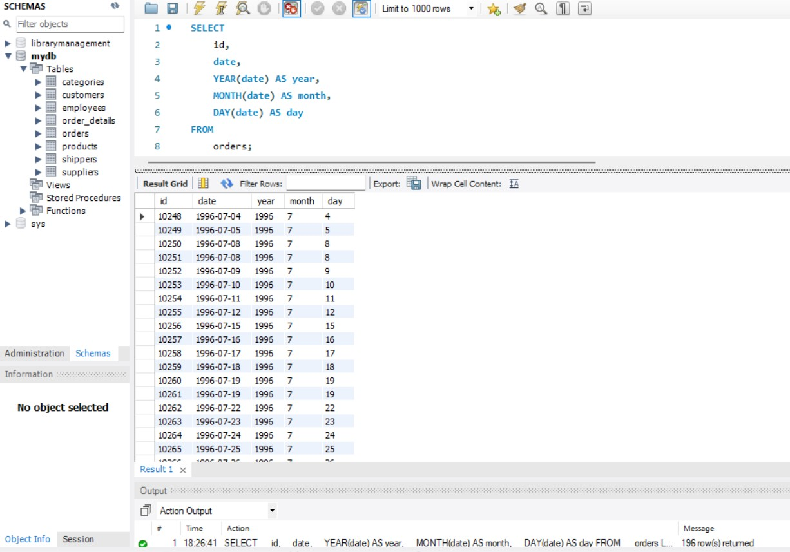
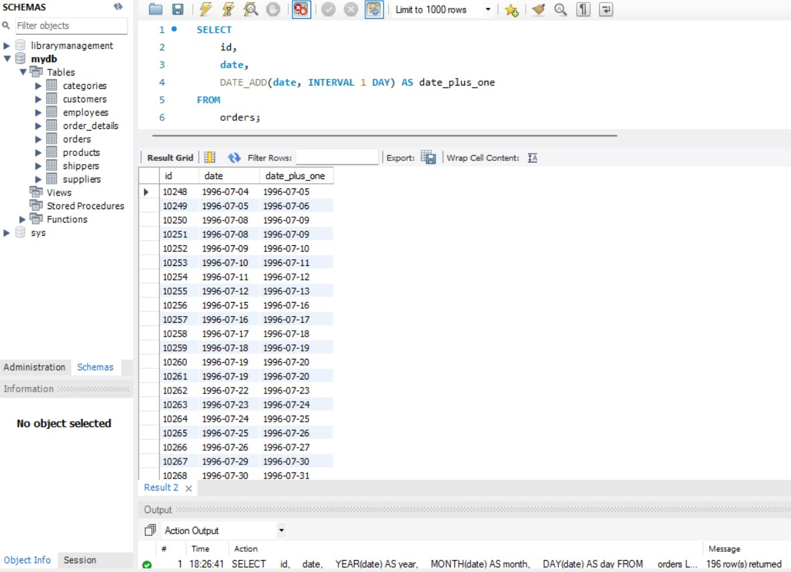
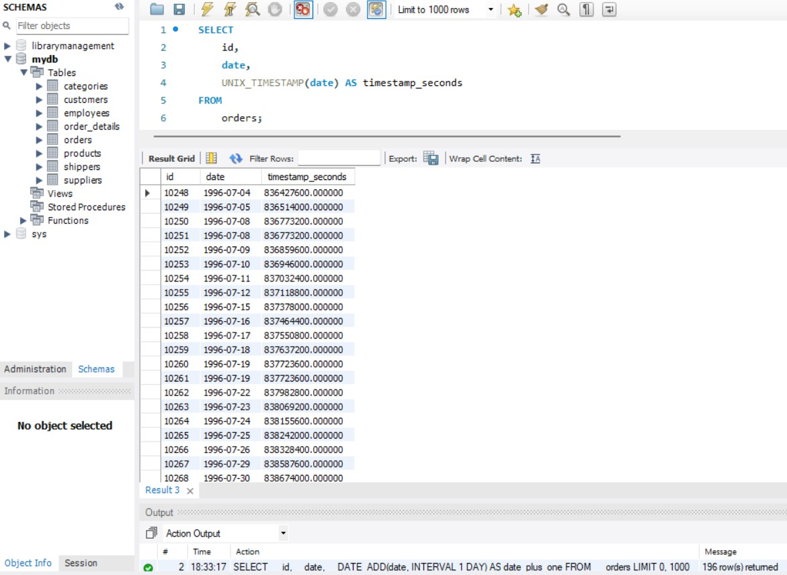
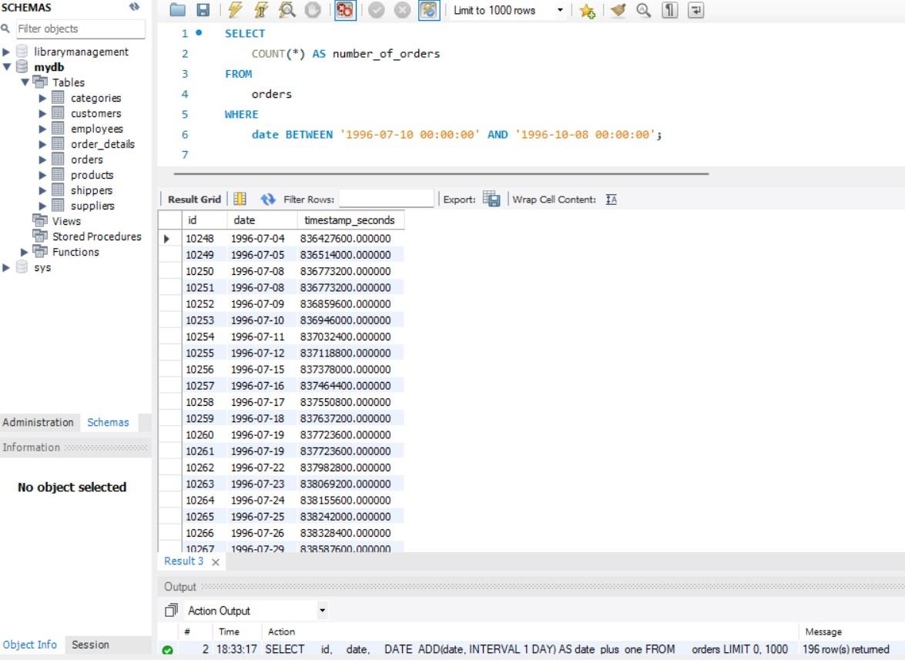
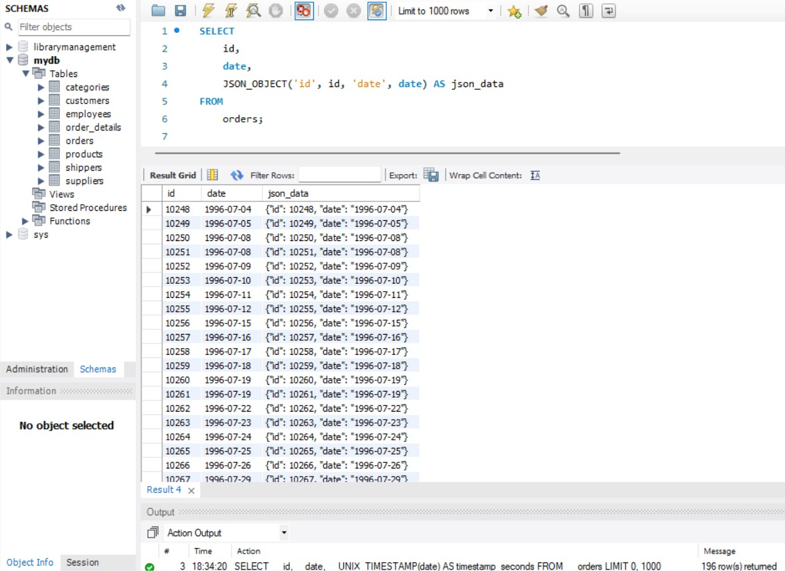

# goit-rdb-hw-07

1. Напишіть SQL-запит, який для таблиці orders з атрибута date витягує рік, місяць і число. Виведіть на екран їх у три окремі атрибути поряд з атрибутом id та оригінальним атрибутом date (всього вийде 5 атрибутів).

Результат:

2. Напишіть SQL-запит, який для таблиці orders до атрибута date додає один день. На екран виведіть атрибут id, оригінальний атрибут date та результат додавання.

Результат:

3. Напишіть SQL-запит, який для таблиці orders для атрибута date відображає кількість секунд з початку відліку (показує його значення timestamp). Для цього потрібно знайти та застосувати необхідну функцію. На екран виведіть атрибут id, оригінальний атрибут date та результат роботи функції.

Результат:

4. Напишіть SQL-запит, який рахує, скільки таблиця orders містить рядків з атрибутом date у межах між 1996-07-10 00:00:00 та 1996-10-08 00:00:00.

Результат:

5. Напишіть SQL-запит, який для таблиці orders виводить на екран атрибут id, атрибут date та JSON-об’єкт {"id": <атрибут id рядка>, "date": <атрибут date рядка>}. Для створення JSON-об’єкта використайте функцію.

Результат:

